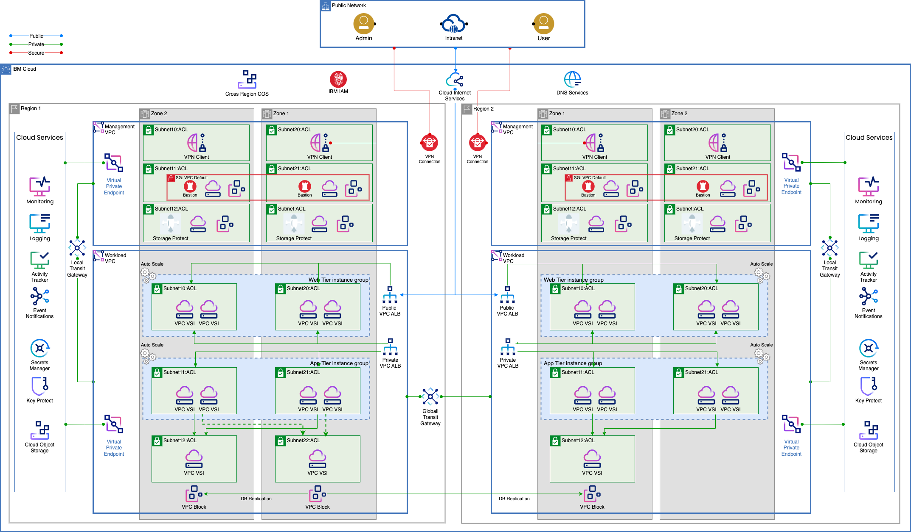
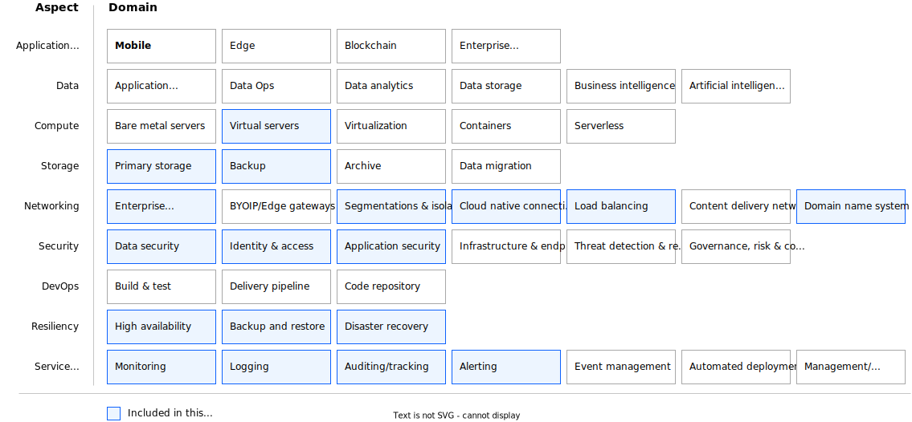

---

copyright:
  years: 2023
lastupdated: "2023-12-13"

keywords: # Not typically populated

subcollection: pattern-vpc-vsi-cross-region-resiliency

authors:
  - name: Carol Hernandez
    url: https://linkedin.com/in/carolbhernandez

# The release that the reference architecture describes
version: 1.0

# Use if the reference architecture has deployable code.
# Value is the URL to land the user in the IBM Cloud catalog details page for the deployable architecture.
# See https://test.cloud.ibm.com/docs/get-coding?topic=get-coding-deploy-button
deployment-url:

docs: https://cloud.ibm.com/docs/pattern-vpc-vsi-cross-region-resiliency

# use-case from 'code' column in
# https://github.ibm.com/digital/taxonomy/blob/main/topics/topics_flat_list.csv
use-case: VirtualPrivateCloud

content-type: reference-architecture

---

{{site.data.keyword.attribute-definition-list}}

# Web app cross-region resiliency
{: #web-app-cross-region}
{: toc-content-type="reference-architecture"}
{: toc-use-case="VirtualPrivateCloud"}
{: toc-version="1.0"}

The web app cross-region resiliency architecture deploys a 3-tier web application on Virtual Servers for VPC using compute, storage, and network cloud resources as well as other Cloud Services provisioned in multiple availability zones across two regions to protect from region-wide natural disasters or outages.

## Architecture diagram
{: #architecture-diagram}

{: caption="Figure 1. Web App Cross-Region Resiliency Solution Architecture" caption-side="bottom"}

The Web, Application, and Database tiers are deployed on Virtual Servers for VPC (VSIs) within the Workload Virtual Private Cloud (VPC).
- The virtual servers in the web and app tiers are placed within [Placement Groups](/docs/vpc?topic=vpc-about-placement-groups-for-vpc&interface=ui) for host failure protection and are part of [Instance Groups](/docs/vpc?topic=vpc-creating-auto-scale-instance-group&interface=ui) for autoscaling.
- A [VPC Application Load Balancer](/docs/vpc?topic=vpc-load-balancers) is used at the web and app tiers to route traffic to healthy application instances.
- IBM Storage Protect is used to create database backups to enable data recovery. \n \n

The Web Application is deployed across two regions by using an active-standby approach to enable failover if an outage of the primary region occurs.
- The Web and App tiers are deployed across two availability zones in the primary region and the second region.
- The Database tier is deployed in active-standby across two availability zones in the primary region with another standby replica in one availability zone in the second region. Data replication is handled by the database software based on HA/DR configuration settings.
- The [Cloud Internet Services (CIS)](/docs/cis?topic=cis-getting-started) is configured as a Global Load Balancer to route traffic to the appropriate region. \n \n

All data is encrypted using customer-provided keys that are managed by [Key Protect](/docs/key-protect?topic=key-protect-about).
- All storage is encrypted at rest by using storage encryption with customer-provided keys that are managed by Key Protect. Key Protect is provisioned in the primary region and configured with failover units in the second region.
- Data is encrypted in transit that uses TLS encryption. A [Secrets Manager](https://cloud.ibm.com/catalog/services/secrets-manager){: external} instance is deployed in each region to store and manage SSL/TLS certificates.

## Design scope
{: #design-scope}

Following the [Architecture Framework](/docs/architecture-framework?topic=architecture-framework-intro), the web app cross-region resiliency architecture covers design considerations and architecture decisions for the following aspects and domains:

- **Compute:** Virtual Servers

- **Storage:** Primary Storage, Backup Storage

- **Networking:** Enterprise Connectivity, Segmentation and Isolation, Cloud Native Connectivity, Load Balancing, DNS

- **Security:** Data Security, Identity and Access Management, Application Security, Infrastructure and Endpoint Security

- **Resiliency:** High Availability, Disaster Recovery, Backup and Restore,

- **Service Management:** Monitoring, Logging, Auditing, Alerting

 {: caption="Figure 2. Web App Cross-Region Resiliency Architecture Design Scope" caption-side="bottom"}

The Architecture Framework provides a consistent approach to design cloud solutions by addressing requirements across a set of "aspects" and "domains", which are technology-agnostic architectural areas that need to be considered for any enterprise solution. See [Introduction to the Architecture Framework](/docs/architecture-framework?topic=architecture-framework-intro) for more details.

## Requirements
{: #requirements}

| Aspects | Requirements |
| -------------- | -------------- |
| Compute            | Provide properly isolated compute resources with adequate compute capacity for the applications. |
| Storage            | Provide storage that meets the application and database performance requirements. |
| Networking         | * Deploy workloads in an isolated environment and enforce information flow policies. \n * Provide secure, encrypted connectivity to the cloud’s private network for management purposes. \n * Distribute incoming application requests across available compute resources. \n * Support failover of application to alternative site if planned or unplanned outages occur \n * Provide public and private DNS resolution to support use of hostnames instead of IP addresses. |
| Security           | * Ensure that all operator actions are run securely through a bastion host. \n * Protect the boundaries of the application against denial-of-service and application-layer attacks. \n * Encrypt all application data in transit and at rest to protect it from unauthorized disclosure. \n * Encrypt all backup data to protect it from unauthorized disclosure. \n * Encrypt all security data (operational and audit logs) to protect from unauthorized disclosure. \n * Encrypt all data by using customer-managed keys to meet regulatory compliance requirements for more security and customer control. \n * Protect secrets through their entire lifecycle and secure them using access control measures. |
| Resiliency         | * Support application availability targets and business continuity policies. \n * Ensure availability of the application if planned and unplanned outages occur. \n * Provide highly available compute, storage, network, and other cloud services to handle application load and performance requirements. \n * Backup application data to enable recovery if unplanned outages occur. \n * Provide highly available storage for security data (logs) and backup data. \n * Automate recovery tasks to minimize downtime |
| Service Management | * Monitor system and application health metrics and logs to detect issues that might impact the availability of the application. \n * Generate alerts/notifications about issues that might impact the availability of applications to trigger appropriate responses to minimize downtime. \n * Monitor audit logs to track changes and detect potential security problems. \n * Provide a mechanism to identify and send notifications about issues that are found in audit logs. |
{: caption="Table 1. Web app cross-region resiliency requirements" caption-side="bottom"}

## Components
{: #components}

| Aspects | Solution Components | How the component is used |
| -------------- | -------------- | -------------- |
| Compute            | [Virtual Servers for VPC](https://cloud.ibm.com/vpc-ext/provision/vs){: external}                        | Web, App, and database servers           |
| Storage            | [Block Storage for VPC](/docs/openshift?topic=openshift-vpc-block)                                    | Database servers storage                     |
|                    | [Cloud Object Storage](/docs/cloud-object-storage?topic=cloud-object-storage-about-cloud-object-storage)                                                                                      | Web app static content, backups, logs (application, operational, and audit logs)                                                       |
| Networking         | [VPC Virtual Private Network (VPN) Client](/docs/iaas-vpn?topic=iaas-vpn-getting-started)                | Remote access to manage resources in a private network                                                       |
|                    | [Virtual Private Clouds (VPCs), Subnets, Security Groups (SGs), ACLs](/docs/vpc?topic=vpc-getting-started)                                                                                          | VPCs for workload isolation Subnets, SGs, and ACLs for restricted access to web, app, and database tiers                              |
|                    | [Transit Gateway (TGW)](/docs/transit-gateway?topic=transit-gateway-getting-started)                                                                                                                | Local Transit Gateway connects the Workload and Management VPCs within a region. \n Global Transit Gateway connects VPCs across regions. |
|                    | [Virtual Private Gateway & Virtual Private Endpoint (VPE)](/docs/vpc?topic=vpc-about-vpe)               | Private network access to Cloud Services, for example Key Protect, Cloud Object Storage, and so on.        | [VPC Application Load Balancer](/docs/vpc?topic=vpc-load-balancers)                | Application Load Balancing for web and app tiers   |
|                    | [Public Gateway](/docs/vpc?topic=vpc-about-networking-for-vpc&interface=cli#public-gateway-for-external-connectivity)              | Web app access to the internet    |
|                    | [Cloud Internet Services (CIS)](/docs/cis?topic=cis-getting-started)                                                                                                                                | Global Load balancing between regions. \n Public DNS resolution.  |
|                    | [DNS Services](/docs/dns-svcs?topic=dns-svcs-about-dns-services)                    | Private DNS resolution                                                                                                                |
| Security           | [IAM](/docs/account?topic=account-cloudaccess)   | IBM Cloud Identity & Access Management           |
|                    | [BYO Bastion Host on VPC VSI with PAM SW](/docs/framework-financial-services?topic=framework-financial-services-vpc-architecture-connectivity-bastion-tutorial-teleport)                            | Remote access with Privileged Access Management  |
|                    | [Cloud Internet Services (CIS)](/docs/cis?topic=cis-getting-started)                 | DDoS protection and Web App Firewall          |
|                    | [Key Protect](/docs/key-protect?topic=key-protect-about)                        | Key Management Service         |
|                    | [Secrets Manager](https://cloud.ibm.com/catalog/services/secrets-manager){: external}   | Certificate and Secrets Management     |
| Resiliency         | [Placement Groups](/docs/vpc?topic=vpc-about-placement-groups-for-vpc&interface=ui) and [Instance Groups](/docs/vpc?topic=vpc-creating-auto-scale-instance-group&interface=ui) | To avoid single points of failure and adjust capacity based on load changes     |
|                    | VPC VSIs, VPC Block across multiple zones in two regions   | Web, app, database high availability and disaster recovery   |
|                    | [IBM Storage Protect](https://cloud.ibm.com/catalog/content/SPonIBMCloud-20c54034-d319-48c0-beb6-0b4adc54265c-global){: external} | Database backups    |
|                    | [Cross-Region Cloud Object Storage Buckets](/docs/cloud-object-storage/basics?topic=cloud-object-storage-endpoints#endpoints-geo)   | Backup storage       |
| Service Management | [IBM Cloud Monitoring](/docs/monitoring?topic=monitoring-about-monitor)      | Apps and operational monitoring.           |
|                    | [IBM Log Analysis](/docs/log-analysis?topic=log-analysis-getting-started)        | Apps and operational logs               |
|                    | [IBM Cloud Activity Tracker](/docs/activity-tracker?topic=activity-tracker-getting-started)         | Audit logs           |
{: caption="Table 2. Web app cross-region resiliency components" caption-side="bottom"}
