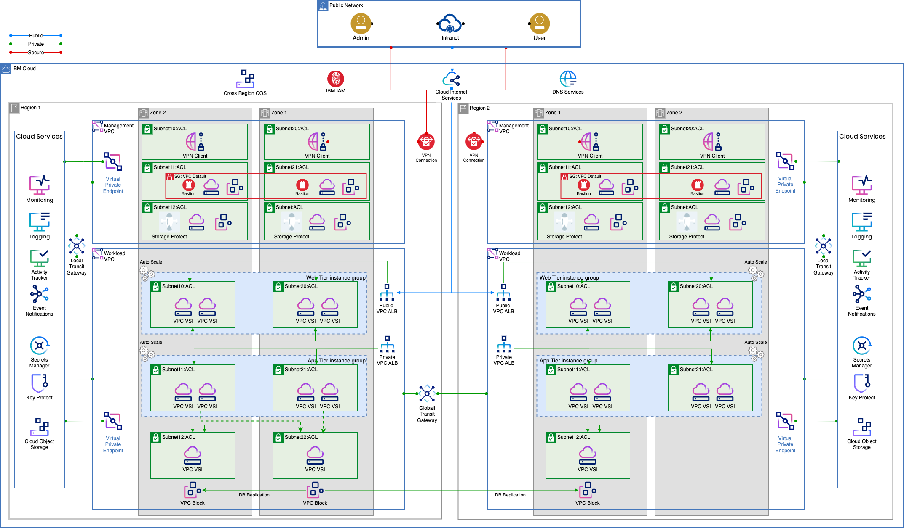

---

copyright:
  years: 2023
lastupdated: "2023-11-28"

subcollection: pattern-vpc-vsi-cross-region-resiliency

keywords:

# The release that the reference architecture describes
version: 1.0

# Use if the reference architecture has deployable code.
# Value is the URL to land the user in the IBM Cloud catalog details page for the deployable architecture.
# See https://test.cloud.ibm.com/docs/get-coding?topic=get-coding-deploy-button
deployment-url: url

# use-case from 'code' column in
# https://github.ibm.com/digital/taxonomy/blob/main/topics/topics_flat_list.csv
use-case: Virtual private cloud

# industry from 'code' column in
# https://github.ibm.com/digital/taxonomy/blob/main/industries/industries_flat_list.csv
industry:

# compliance from 'code' column in
# https://github.ibm.com/digital/taxonomy/blob/main/compliance_entities/compliance_entities_flat_list.csv
compliance:

# content-type: reference-architecture

---

# Web App Cross-Region Resiliency
{: #pattern-title}

<!--
The following line inserts all the attribute definitions. Don't delete.

{: #title-id}
{: toc-content-type="reference-architecture"}
{: toc-industry="value"}
{: toc-use-case="value"}
{: toc-compliance="value"}
{: toc-version="value"}
-->

<!--
The IDs, such as {: #title-id} are required for publishing this reference architecture in IBM Cloud Docs. Set unique IDs for each heading. Also include
the toc attributes on the H1, repeating the values from the YAML header.

:information_source: **Tip:** For more information about this template, see [Creating reference architectures](https://test.cloud.ibm.com/docs/writing?topic=writing-reference-architectures).

-->

The Web App Cross-Region Resiliency pattern deploys a 3-tier web application on VPC Virtual Servers using compute, storage, and network cloud resources as well as other Cloud Services provisioned in multiple availability zones across two regions to protect from region-wide natural disasters or outages.

This pattern is recommended to address out-of-region disaster recovery policies or business continuity policies with geo or distance compliance requirements. It supports recovery point objective (RPO)\<=15 mins and recovery time objective (RTO)\<=1 hour requirements.

## Architecture diagram
{: #architecture-diagram}

 [Web App Cross-Region Resiliency Solution Architecture]
{: caption="Figure 1. A description that prints on the page" caption-side="bottom"}

## Design scope
{: #design-scope}

Following the [Architecture Framework](https://cloud.ibm.com/docs/architecture-framework?topic=architecture-framework-intro)\*, the Web App Cross-Region Resiliency pattern covers design considerations and architecture decisions for the following aspects and domains:

- **Compute:** Virtual Servers

- **Storage:** Primary Storage, Backup Storage

- **Networking:** Enterprise Connectivity, Segmentation and Isolation, Cloud Native Connectivity, Load Balancing, DNS

- **Security:** Data Security, Identity and Access Management, Application Security, Infrastructure and Endpoint Security

- **Resiliency:** High Availability, Disaster Recovery, Backup and Restore,

- **Service Management:** Monitoring, Logging, Auditing, Alerting

<!--
 
-->

| Aspects            | Domains                 |                              |                            |                             |                             |                               |                           |
|--------------------|-------------------------|------------------------------|----------------------------|-----------------------------|-----------------------------|-------------------------------|---------------------------|
| Compute            | Bare Metal Servers      | Virtual Servers              | Virtualization             | Containers                  | Serverless                  |                               |                           |
| Storage            | Primary Storage         | Backup                       | Archive                    | Data  Migration             |                             |                               |                           |
| Networking         | Enterprise Connectivity | BYOIP/Edge Gateways          | Segmentation and Isolation | Cloud Native Connectivity   | Load Balancing              | CDN                           | DNS                       |
| Security           | Data Security           | Identity & Access Management | Application Security       | Infrastructure and Endpoint | Threat Detection & Response | Governance, Risk & Compliance |                           |
| Resiliency         | High Availability       | Disaster Recovery            | Backup and Restore         |                             |                             |                               |                           |
| Service Management | Monitoring              | Logging                      | Auditing                   | Alerting                    | Event Management            | Automated Deployment          | Management/ Orchestration |
| Data               | Application Integration | Data Ops                     | Data Analytics             | Data Storage                | Business Intelligence       | Artificial Intelligence       |                           |
{: caption="Table 1. Web App Cross-Region Resiliency Solution Design Scope" caption-side="bottom"}

\*The Architecture Framework provides a consistent approach to design cloud solutions by addressing requirements across a set of "aspects" and "domains", which are technology-agnostic architectural areas that need to be considered for any enterprise solution. See [Introduction to the Architecture Framework](https://cloud.ibm.com/docs/architecture-framework?topic=architecture-framework-intro) for more details.

## Requirements
{: #requirements}

| Aspect | Requirements |
| -------------- | -------------- |
| Compute            | Provide properly isolated compute resources with adequate compute capacity for the applications. |
| Storage            | Provide storage that meets the application and database performance requirements. |
| Networking         | Deploy workloads in isolated environment and enforce information flow policies. \n Provide secure, encrypted connectivity to the cloud’s private network for management purposes. \n Distribute incoming application requests across available compute resources. \n Support failover of application to alternate site in the event of planned or unplanned outages \n Provide public and private DNS resolution to support use of hostnames instead of IP addresses. |
| Security           | Ensure all operator actions are executed securely through a bastion host. \n Protect the boundaries of the application against denial-of-service and application-layer attacks. \n Encrypt all application data in transit and at rest to protect from unauthorized disclosure. \n Encrypt all backup data to protect from unauthorized disclosure. \n Encrypt all security data (operational and audit logs) to protect from unauthorized disclosure. \n Encrypt all data using customer managed keys to meet regulatory compliance requirements for additional security and customer control. \n Protect secrets through their entire lifecycle and secure them using access control measures. |
| Resiliency         | Support application availability targets and business continuity policies. \n Ensure availability of the application in the event of planned and unplanned outages. \n Provide highly available compute, storage, network, and other cloud services to handle application load and performance requirements. \n Backup application data to enable recovery in the event of unplanned outages. \n Provide highly available storage for security data (logs) and backup data. \n Automate recovery tasks to minimize down time |
| Service Management | Monitor system and application health metrics and logs to detect issues that might impact the availability of the application. \n Generate alerts/notifications about issues that might impact the availability of applications to trigger appropriate responses to minimize down time. \n Monitor audit logs to track changes and detect potential security problems. \n Provide a mechanism to identify and send notifications about issues found in audit logs. |
{: caption="Table 1. Pattern requirements" caption-side="bottom"}

## Architecture overview
{: #architecture-overview}

-   The Web, Application, and Database tiers are deployed on VPC Virtual Server Instances (VSIs). Cloud Object Storage (COS) is used to store static web content. High performance VPC block storage (10 IOPS/GB) is used for the database tier.

-   The virtual servers in the Web and App tiers are placed within [Placement Groups](https://cloud.ibm.com/docs/vpc?topic=vpc-about-placement-groups-for-vpc&interface=ui) for host failure protection and are part of [Instance Groups](https://cloud.ibm.com/docs/vpc?topic=vpc-creating-auto-scale-instance-group&interface=ui) for autoscaling. A VPC Application Load Balancer (ALB) is used at the web and app tiers tier to route traffic to healthy application instances.

-   The Web, Application, and Database tiers are deployed within the Workload Virtual Private Cloud (VPC). Management tools, such as backup tools, are deployed in the Management VPC. A local Transit Gateway allows traffic between the management and workload VPCs.

-   Virtual servers for each tier are placed in separate subnets within each availability zone. Security groups and ACLs are used as firewalls to limit access to virtual server instances for operational purposes and control network traffic to each web app tier.

-   The Cloud Internet Service is deployed as a proxy to the public VPC Application Load Balancer that front ends the web tier to provide Distributed Denial of Service (DDoS) protection and Web Application Firewall protection to the web servers exposed to the internet.

-   The Web Application is deployed across two regions using an active-standby approach to enable failover in the event of an outage of the primary region. A Global Transit Gateway connects VPCs across the two regions.

-   The Web and App tiers are deployed across two availability zones in the primary region and the DR region.

-   The Database tier is deployed in active-standby across two availability zones in the primary region with another standby replica in one availability zone in the DR region. Data replication is handled by the database software based on HA/DR configuration settings.

-   The Cloud Internet Service is configured as a Global Load Balancer to route traffic to the appropriate region.

-   All data is encrypted using customer-provided keys managed by Key Protect. All storage is encrypted at rest using storage encryption with customer-provided keys managed by Key Protect. Key Protect is provisioned in the primary region and configured with failover units in the second region.

-   Data is encrypted in transit using TLS encryption. A Secrets Manager instance is deployed in each region to store and manage SSL/TLS certificates.

-   IBM Storage Protect is used to create database backups to enable data recovery.

-   IBM Monitoring, IBM Logging, and Activity Tracker instances are deployed in each region. IBM Monitoring is used to check the health of the servers and storage as well as the health of the web application. IBM Logging is used to get logs from the servers, storage, and web application. Monitoring and Logging data is stored in Cloud Object Storage based on the selected retention period. Activity Tracker stores audit logs in Cloud Object Storage. Logs stored in COS are encrypted at rest using COS encryption with customer-provided keys.

-   A VPC VPN Client in the Management VPC in each region provides operational access to resources within the IBM Cloud private network.

-   A bastion host in the Management VPC in each region is used to provide remote access to the infrastructure and application for management purposes and to record all access and opertions performed by remote users for audit purposes.

## Components
{: #components}

| Aspect | Solution Component | How the component is used |
| -------------- | -------------- | -------------- |
| Compute            | [VPC VSIs](https://cloud.ibm.com/vpc-ext/provision/vs)                                                                                                                                                                   | Web, App, and database servers                                                                                                        |
| Storage            | [VPC Block Storage](https://cloud.ibm.com/docs/openshift?topic=openshift-vpc-block)                                                                                                                                      | Database servers storage                                                                                                              |
|                    | [Cloud Object Storage](https://cloud.ibm.com/docs/cloud-object-storage?topic=cloud-object-storage-about-cloud-object-storage) (COS)                                                                                      | Web app static content, backups, logs (application, operational and audit logs)                                                       |
| Networking         | [VPC Virtual Private Network (VPN) Client](https://cloud.ibm.com/docs/iaas-vpn?topic=iaas-vpn-getting-started)                                                                                                           | Remote access to manage resources in private network                                                                                  |
|                    | [Virtual Private Clouds (VPCs), Subnets, Security Groups (SGs), ACLs](https://cloud.ibm.com/docs/vpc?topic=vpc-getting-started)                                                                                          | VPCs for workload isolation Subnets, SGs, and ACLs for restricted access to web, app, and database tiers                              |
|                    | [Transit Gateway (TGW)](https://cloud.ibm.com/docs/transit-gateway?topic=transit-gateway-getting-started)                                                                                                                | Local Transit Gateway connects the Workload and Management VPCs within a region. \n Global Transit Gateway connects VPCs across regions. |
|                    | [Virtual Private Gateway & Virtual Private Endpoint (VPE)](https://cloud.ibm.com/docs/vpc?topic=vpc-about-vpe)                                                                                                           | Private network access to Cloud Services, e.g. Key Protect, COS, etc.                                                                 |
|                    | [VPC Application Load Balancer](https://cloud.ibm.com/docs/vpc?topic=vpc-load-balancers)                                                                                                                                 | Application Load Balancing for web and app tiers                                                                                      |
|                    | [Public Gateway](https://cloud.ibm.com/docs/vpc?topic=vpc-about-networking-for-vpc&interface=cli#public-gateway-for-external-connectivity)                                                                               | Web app access to the internet                                                                                                        |
|                    | [Cloud Internet Services (CIS)](https://cloud.ibm.com/docs/cis?topic=cis-getting-started)                                                                                                                                | Global Load balancing between regions. \n Public DNS resolution.                                                                         |
|                    | [DNS Services](https://cloud.ibm.com/docs/dns-svcs?topic=dns-svcs-about-dns-services)                                                                                                                                    | Private DNS resolution                                                                                                                |
| Security           | [IAM](https://cloud.ibm.com/docs/account?topic=account-cloudaccess)                                                                                                                                                      | IBM Cloud Identity & Access Management                                                                                                |
|                    | [BYO Bastion Host on VPC VSI with PAM SW](https://cloud.ibm.com/docs/framework-financial-services?topic=framework-financial-services-vpc-architecture-connectivity-bastion-tutorial-teleport)                            | Remote access with Privileged Access Management                                                                                       |
|                    | [Cloud Internet Services (CIS)](https://cloud.ibm.com/docs/cis?topic=cis-getting-started)                                                                                                                                | DDoS protection and Web App Firewall                                                                                                  |
|                    | [Key Protect](https://cloud.ibm.com/docs/key-protect?topic=key-protect-about)                                                                                                                                            | Key Management Service                                                                                                                |
|                    | [Secrets Manager](https://cloud.ibm.com/catalog/services/secrets-manager)                                                                                                                                                | Certificate and Secrets Management                                                                                                    |
| Resiliency         | [Placement Groups](https://cloud.ibm.com/docs/vpc?topic=vpc-about-placement-groups-for-vpc&interface=ui) and [Instance Groups](https://cloud.ibm.com/docs/vpc?topic=vpc-creating-auto-scale-instance-group&interface=ui) | To avoid single points of failure and adjust capacity based on load changes                                                           |
|                    | VPC VSIs, VPC Block across multiple zones in two regions                                                                                                                                                                 | Web, app, database high availability and disaster recovery                                                                            |
|                    | [IBM Storage Protect](https://cloud.ibm.com/catalog/content/SPonIBMCloud-20c54034-d319-48c0-beb6-0b4adc54265c-global)                                                                                                    | Database backups                                                                                                                      |
|                    | [Cross-Region COS Buckets](https://cloud.ibm.com/docs/cloud-object-storage/basics?topic=cloud-object-storage-endpoints#endpoints-geo)                                                                                    | Backup storage                                                                                                                        |
| Service Management | [IBM Cloud Monitoring](https://cloud.ibm.com/docs/monitoring?topic=monitoring-about-monitor)                                                                                                                             | Apps and operational monitoring.                                                                                                      |
|                    | [IBM Log Analysis](https://cloud.ibm.com/docs/log-analysis?topic=log-analysis-getting-started)                                                                                                                           | Apps and operational logs                                                                                                             |
|                    | [IBM Cloud Activity Tracker](https://cloud.ibm.com/docs/activity-tracker?topic=activity-tracker-getting-started)                                                                                                         | Audit logs                                                                                                                            |
{: caption="Table 2. Cross-Region Resiliency for Web Apps Solution Components" caption-side="bottom"}
